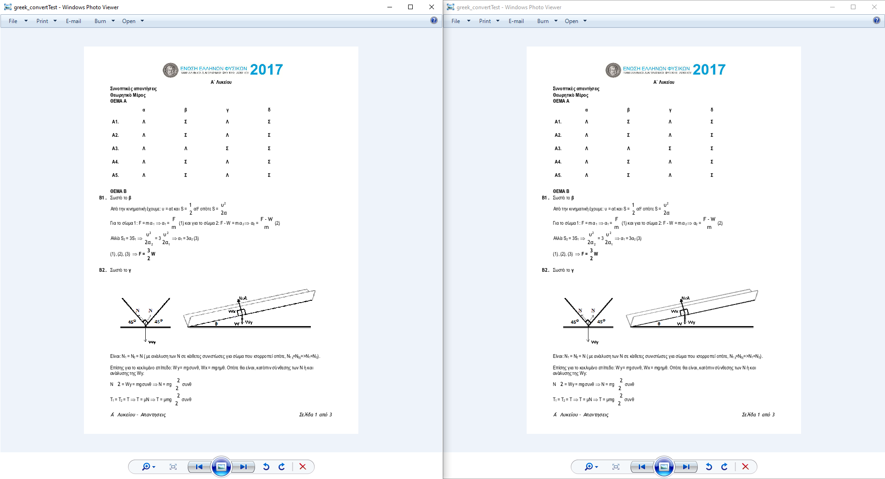
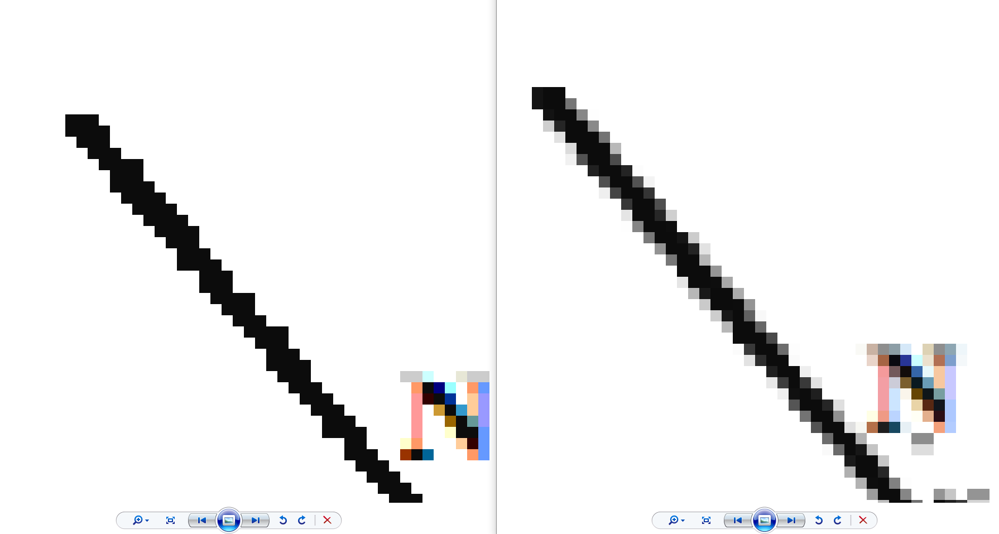
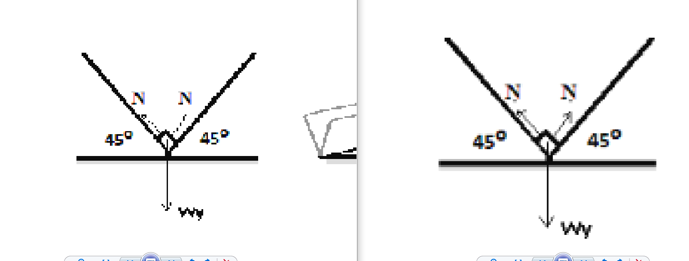
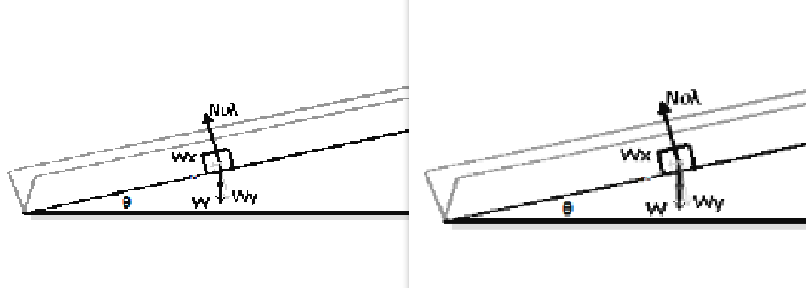

# Overall 
3rd Oct 2026
Changed image resizing algorithm from simple Nearest Neighbour to Bilinear Interpolation.

# Detail
PDF Files can contain images but often they are not in the right size/state. We often have to resize images, apply masks etc. This change is to address low quality of image resizing, that didn't even have anti-aliasing of any kind and lost a lot of information on the resize.

Now instead of just trying to map pixels directly from original to sized image based on ratio (Nearest Neighbour), we interpolate X and Y coordinates in width dimension and then we do linear interpolation between interpolated X and Y but in height dimension. In detail example and math explained in references.

# References
https://chao-ji.github.io/jekyll/update/2018/07/19/BilinearResize.html

# Examples
Not zoomed

Zoom 1:

Zoom 2:

Zoom 3:

