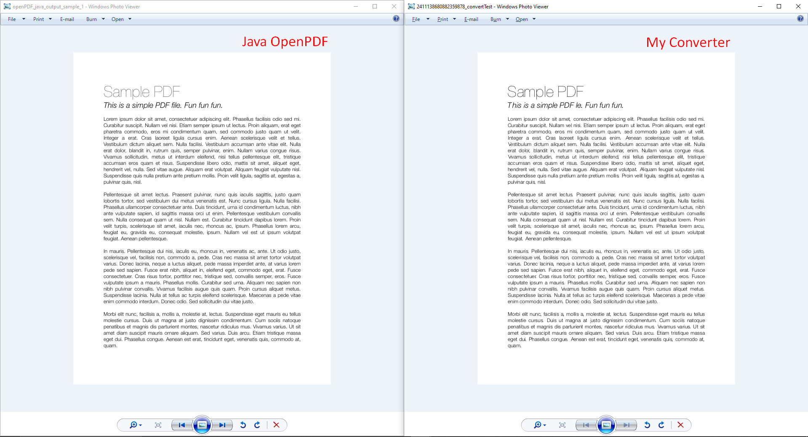

# PDFToImageConverter
Simple converter that can convert PDF to image formats (jpg, png, tiff, bmp..)
There are 2 goals for this project:
  - To learn about different file formats and technologies that are used by pdf and implement solution that can convert most files without use of any 3rd party libraries*. Before starting this project I didn't know anything about any file format, pdf, rendering, fonts, font matrices, affine transformations etc..
  - .NET doesn't really have PDF Converter that is free, open source and that doesn't use any 3rd party library (this isn't really a goal I guess just random observation)

Development is heavily in progress which is why code can appear messy and have obvious bad practices which are just leftovers of some original ideas or trying outs that I realized aren't going to work along the way and am cleaning them up as I go. 

Currently I am working on implementing basic Adobe Type 1 font interpreter and rasterizer.
Only font type that is currently supported is TrueType.
Both normal and compressed (stream) pdfs are supported.
No color processing supported yet.
Small number of PDF Graphics Object operators supported currently.

Example and comparison

Rasterizer is currently C# rewrite of public domain single header STBTrueType.h from Sean Barrett ** This is just one file that is rewritten as a class , so while this is technically 3rd party lib C# version will be maintained by myself and be part of the library (I might just release standalone version of it for C#)**

*Any 3rd party libraries that are used are by other projects for easier testing and comparing results, converter library itself doesn't have any 3rd party libraries.